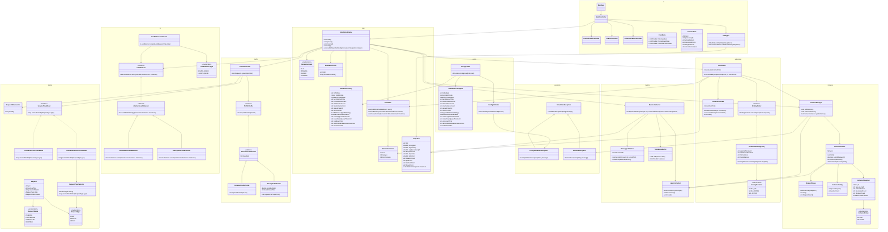

```mermaid
classDiagram
    namespace model {
        class Request {
            +long id
            +long arrivalTime
            +long serviceTimeMs
            +RequestType type
            +RequestStatus status
        }
        class RequestStatus {
            <<enumeration>>
            PENDING
            PROCESSING
            COMPLETED
            DROPPED
        }
        class RequestType {
            <<enumeration>>
            LIGHT
            MEDIUM
            HEAVY
        }
        class RequestIdGenerator {
            +long nextId()
        }
        class ServiceTimeModel {
            <<interface>>
            +long serviceTimeMs(RequestType type)
        }
        class ConstantServiceTimeModel {
            +long serviceTimeMs(RequestType type)
        }
        class RequestTypeSelector {
            +RequestType select()
            +long serviceTimeMsFor(RequestType type)
        }
        class DistributedServiceTimeModel {
            +long serviceTimeMs(RequestType type)
        }
    }

    namespace traffic {
        class TrafficProfile {
            <<interface>>
            +int requestsForTick(int tick)
        }
        class AbstractTrafficProfile {
            <<abstract>>
            #int baseRate
        }
        class ConstantTrafficProfile {
            +int requestsForTick(int tick)
        }
        class BurstyTrafficProfile {
            -double burstMultiplier
            -int burstIntervalTicks
            +int requestsForTick(int tick)
        }
        class TrafficGenerator {
            +List~Request~ generate(int tick)
        }
    }

    namespace lb {
        class LoadBalancer {
            <<interface>>
            +ServiceInstance select(List~ServiceInstance~ instances)
        }
        class AbstractLoadBalancer {
            <<abstract>>
            #void validateNotEmpty(List~ServiceInstance~ instances)
        }
        class RoundRobinLoadBalancer {
            +ServiceInstance select(List~ServiceInstance~ instances)
        }
        class LeastQueueLoadBalancer {
            +ServiceInstance select(List~ServiceInstance~ instances)
        }
        class LoadBalancerType {
            <<enumeration>>
            ROUND_ROBIN
            LEAST_QUEUE
        }
        class LoadBalancerSelection {
            +LoadBalancer create(LoadBalancerType type)
        }
    }

    namespace instance {
        class RequestQueue {
            +boolean offer(Request r)
            +int size()
            +int droppedCount()
        }
        class InstanceConfig {
            +int queueCapacity
            +int workerCount
        }
        class InstanceStatus {
            <<enumeration>>
            ACTIVE
            DRAINING
        }
        class InstanceSnapshot {
            +String id
            +int queueLength
            +int activeWorkers
            +int processedCount
            +int droppedCount
            +InstanceStatus status
        }
        class ServiceInstance {
            -String id
            +void tick()
            +boolean submit(Request r)
            +int currentQueueSize()
            +InstanceSnapshot snapshot()
        }
        class InstanceManager {
            +void addInstance()
            +void removeInstance()
            +List~ServiceInstance~ getInstances()
        }
    }

    namespace metrics {
        class LatencyTracker {
            +void record(long latencyMs)
            +double average()
            +void reset()
        }
        class ThroughputTracker {
            -int tickDurationMs
            +void record(int count, int currentTick)
            +double requestsPerSecond()
        }
        class TimeSeriesBuffer {
            +void add(double value)
            +List~Double~ values()
        }
        class MetricsCollector {
            +Snapshot buildSnapshot(int tick, List~InstanceSnapshot~ instanceSnapshots)
        }
    }

    namespace core {
        class SimulationState {
            <<enumeration>>
            IDLE
            RUNNING
            PAUSED
            STOPPED
        }
        class SimulationClock {
            +int tick()
            +long simulatedTimeMs()
        }
        class SimulationConfig {
            +int trafficRate
            +String trafficProfile
            +double burstMultiplier
            +int burstIntervalTicks
            +int initialInstanceCount
            +int minInstanceCount
            +int maxInstanceCount
            +int queueCapacity
            +int workerCount
            +LoadBalancerType lbStrategy
            +boolean autoscalerEnabled
            +int scaleUpQueueThreshold
            +int scaleDownQueueThreshold
            +int cooldownTicks
            +int autoscalerEvaluationIntervalTicks
            +int tickDurationMs
        }
        class SimulationEvent {
            +int tick
            +String type
            +String message
        }
        class EventBus {
            +void publish(SimulationEvent event)
            +void subscribe(Consumer~SimulationEvent~ listener)
            +void unsubscribe(Consumer~SimulationEvent~ listener)
        }
        class Snapshot {
            +int tick
            +double throughput
            +double avgLatency
            +double avgQueueLength
            +int droppedCount
            +double dropRate
            +double utilization
            +int instanceCount
            +int lightCount
            +int mediumCount
            +int heavyCount
            +List~InstanceSnapshot~ instances
        }
        class SimulationEngine {
            +void start()
            +void pause()
            +void resume()
            +void stop()
            +void setOnSnapshotReady(Consumer~Snapshot~ listener)
        }
    }

    namespace autoscaler {
        class ScalingDecision {
            <<enumeration>>
            SCALE_UP
            SCALE_DOWN
            NO_ACTION
        }
        class ScalingPolicy {
            <<interface>>
            +ScalingDecision evaluate(Snapshot snapshot)
        }
        class ThresholdScalingPolicy {
            -int scaleUpThreshold
            -int scaleDownThreshold
            -int minInstances
            -int maxInstances
            +ScalingDecision evaluate(Snapshot snapshot)
        }
        class CooldownTracker {
            -int cooldownTicks
            +boolean canScale(int currentTick)
            +void recordScale(int currentTick)
            +void reset()
        }
        class AutoScaler {
            -int evaluationIntervalTicks
            +void evaluate(Snapshot snapshot, int currentTick)
        }
    }

    namespace config {
        class SimulationConfigDto {
            +int trafficRate
            +String trafficProfile
            +double burstMultiplier
            +int burstIntervalTicks
            +int initialInstanceCount
            +int minInstanceCount
            +int maxInstanceCount
            +int queueCapacity
            +int workerCount
            +String loadBalancerStrategy
            +boolean autoscalerEnabled
            +int scaleUpQueueThreshold
            +int scaleDownQueueThreshold
            +int cooldownTicks
            +int autoscalerEvaluationIntervalTicks
            +int tickDurationMs
        }
        class ConfigLoader {
            +SimulationConfig load(Path path)
        }
        class ConfigValidator {
            +void validate(SimulationConfigDto dto)
        }
    }

    namespace exception {
        class SimulationException {
            +SimulationException(String message)
        }
        class ConfigValidationException {
            +ConfigValidationException(String message)
        }
        class InstanceException {
            +InstanceException(String message)
        }
    }

    namespace ui {
        class MainApp
        class MainController
        class ControlPanelController
        class ChartsController
        class InstancesTableController
        class ChartData {
            +List~Double~ latencyValues
            +List~Double~ throughputValues
            +List~Double~ instanceCountValues
        }
        class InstanceRow {
            +String id
            +int queueLength
            +int activeWorkers
            +int processedCount
            +int droppedCount
            +InstanceStatus status
        }
        class UiMapper {
            +ChartData toChartData(Snapshot s)
            +List~InstanceRow~ toInstanceRows(Snapshot s)
        }
    }

    %% ─── VZTAHY ──────────────────────────────────────────

    ServiceTimeModel <|.. ConstantServiceTimeModel
    ServiceTimeModel <|.. DistributedServiceTimeModel
    Request --> RequestStatus
    Request --> RequestType
    DistributedServiceTimeModel --> RequestTypeSelector
    RequestTypeSelector --> RequestType

    TrafficProfile <|.. AbstractTrafficProfile
    AbstractTrafficProfile <|-- ConstantTrafficProfile
    AbstractTrafficProfile <|-- BurstyTrafficProfile
    TrafficGenerator --> TrafficProfile
    TrafficGenerator --> RequestIdGenerator
    TrafficGenerator --> ServiceTimeModel

    LoadBalancer <|.. AbstractLoadBalancer
    AbstractLoadBalancer <|-- RoundRobinLoadBalancer
    AbstractLoadBalancer <|-- LeastQueueLoadBalancer
    LoadBalancerSelection --> LoadBalancerType
    LoadBalancerSelection --> LoadBalancer

    ServiceInstance --> RequestQueue
    ServiceInstance --> InstanceConfig
    ServiceInstance --> InstanceSnapshot
    InstanceManager --> ServiceInstance
    InstanceManager --> LatencyTracker

    MetricsCollector --> LatencyTracker
    MetricsCollector --> ThroughputTracker
    MetricsCollector --> TimeSeriesBuffer

    SimulationEngine --> SimulationState
    SimulationEngine --> SimulationClock
    SimulationEngine --> SimulationConfig
    SimulationEngine --> TrafficGenerator
    SimulationEngine --> LoadBalancer
    SimulationEngine --> InstanceManager
    SimulationEngine --> MetricsCollector
    SimulationEngine --> AutoScaler
    SimulationEngine --> EventBus
    MetricsCollector --> Snapshot

    ScalingPolicy <|.. ThresholdScalingPolicy
    AutoScaler --> ScalingPolicy
    AutoScaler --> CooldownTracker
    AutoScaler --> InstanceManager
    AutoScaler --> SimulationEvent
    AutoScaler --> EventBus
    ThresholdScalingPolicy --> ScalingDecision
    EventBus --> SimulationEvent
    ServiceInstance --> LatencyTracker
    InstanceSnapshot --> InstanceStatus

    ConfigLoader --> SimulationConfigDto
    ConfigLoader --> ConfigValidator
    ConfigLoader --> SimulationConfig
    SimulationException <|-- ConfigValidationException
    SimulationException <|-- InstanceException
    ConfigValidator --> ConfigValidationException
    InstanceManager --> InstanceException

    MainApp --> MainController
    MainController --> ControlPanelController
    MainController --> ChartsController
    MainController --> InstancesTableController
    MainController --> UiMapper
    UiMapper --> Snapshot
    MainController --> SimulationEngine
```
