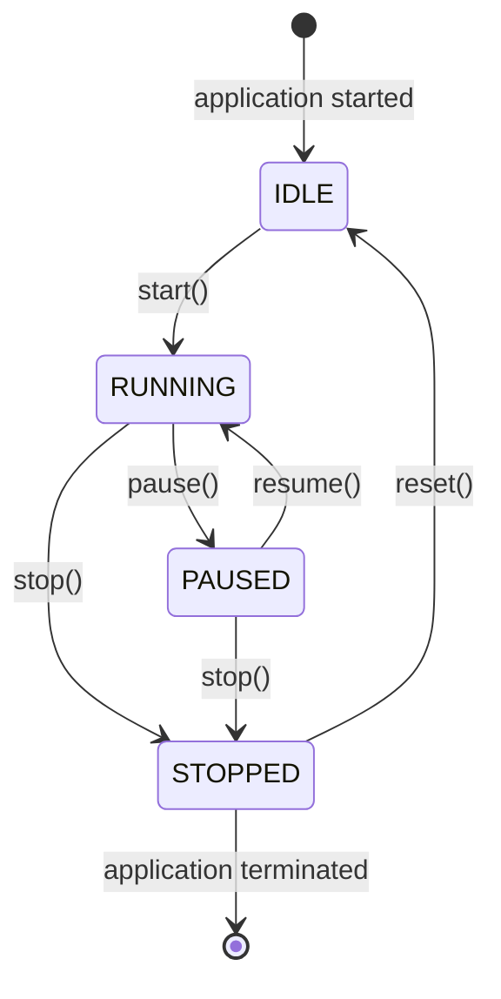

```mermaid
stateDiagram-v2
    [*] --> IDLE : application started

    IDLE --> RUNNING : start()

    RUNNING --> PAUSED : pause()
    RUNNING --> STOPPED : stop()

    PAUSED --> RUNNING : resume()
    PAUSED --> STOPPED : stop()

    STOPPED --> IDLE : reset()
    STOPPED --> [*] : application terminated
```
